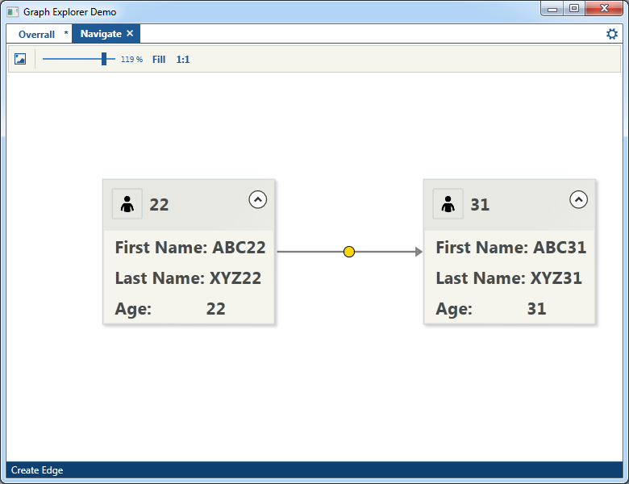

# Project Description

Graph Explorer is an open source .NET control which will help you **navigate**  and **explore** Directed Acyclic Graphs (DAG).

A sample project is included to demonstrate the use of the control.

The component relies on [GraphX](https://graphx.codeplex.com/) for .NET an advanced graph visualization library as well as [Orc.FilterBuilder](https://github.com/Orcomp/Orc.FilterBuilder), a visual control for building complex filtering options.

 

## Usage

The component allows you visualize DAGs contained in a csv file or build diagrams of edges/nodes with unlimited levels of hierarchy. 

 

The main features of the component are:

- Unlimited levels of hierarchy
- Loading data from csv files
- Saving and Loading of application state
- Exporting current application view as image
- View zoom in/out and panning
- Dragging, modifying and deleting of nodes and edges
- Highlights the selected node location as well as its owner. 
- Double click on a node to open open a new window
- Delete, add and reorder of hierarchy relations
- Complex filtering nodes options

  

One of the main features of the control is the complex node filtering capability. It can filter the node visibility by selecting multiple parameters.  

The control provides a simple process for saving and loading the current layout. The state is saved in a common .xml file. 

Dragging of nodes is enabled after pressing the hand button. 

User can modify or add more fields to any node by enabling the edit button.

By double clicking on a node a new tab is created with all neighboring nodes(immediate precedent and descendants).

  

##Create new chart

To display information contained in a csv file, press on the cog button:

  

Locate the data files on the settings window:

  

The *Properties.cvs* and *Relationships.csv* are two data files responsible for chart presentation.

  

The *Properties.cvs* file consist of three fields *ID,Propert* and *Value* and defines each nodes data.

The *Relationships.csv* file defines the relationship between each nodes, and only has two fields  *From* and *To*. These columns will contain the ID for the node

**NOTE:** Collaboration is most welcome.
